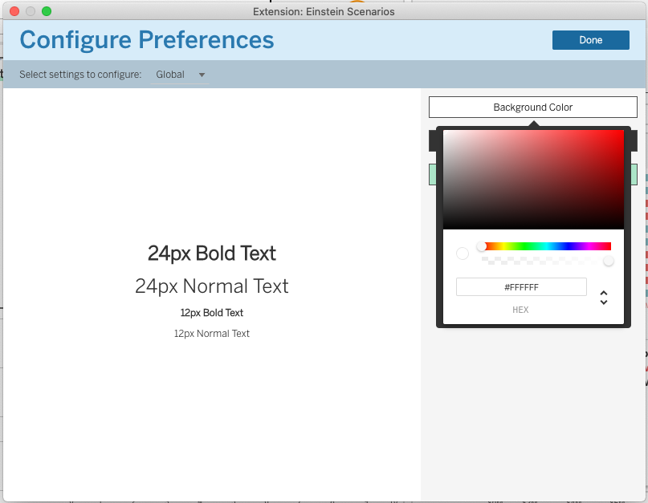
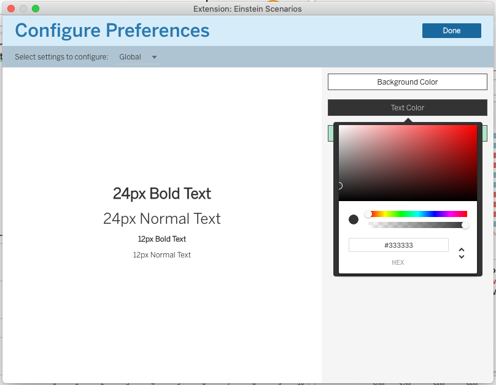
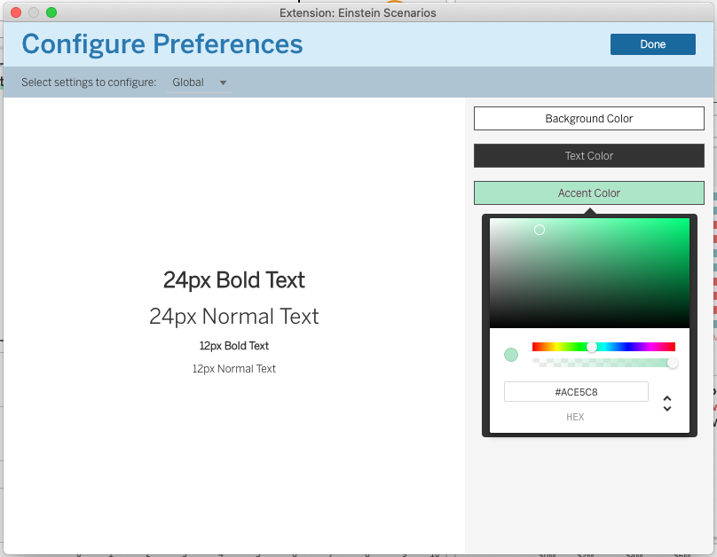

# Global Configuration Options

## Background Color

This setting controls the background color of your extensions.

## Text Color

This setting controls both the text color _and_ the color of the loading indicator (spinner) in your extension.

## Accent Color

This setting controls the accent color that is used in the page selection menu at the top of the extension as well as on the navigation arrows in the Action page.

