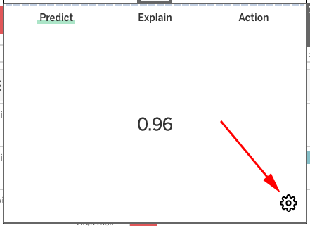
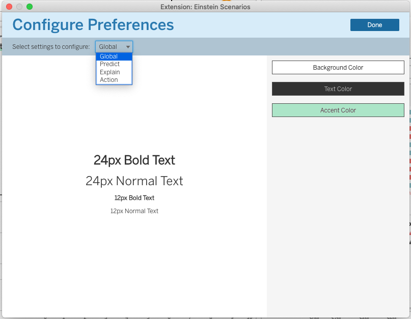

# Preferences

## How to access Preferences

Click the gear icon on the bottom right of the extension window _after_ the extension has been setup.

## Navigation

Use the settings drop down to navigate to different settings.

## Authoring vs viewing

Within Tableau extensions, there are two modes: authoring and viewing. Preferences are available to be set _only_ in authoring mode so, if you aren't seeing a gear icon or the gear icon doesn't show up in your published workbook, that is to be expected.