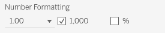

# Number Formatting

In the Preferences Configuration dialog, dashboard authors have access to various controls that allow specification of number formats throughout the extension. Generally, these controls will take this form:

## Decimal places

The first control in the image above allows specification of decimal places. Currently, the extension allows between 0 and 6 (inclusive) decimal places:

| Number of Decimal Places | Drop Down Value |
|:-:|---|
| 0 | `1` |
| 1 | `1.0` |
| 2 | `1.00` |
| 3 | `1.000` |
| 4 | `1.0000` |
| 5 | `1.00000` |
| 6 | `1.000000` |

## Thousands separator

The second control is a checkbox that allows the user to specify whether a separator is used for numbers greater than or equal to 1,000. Currently, there is no mechanism to specify what character is used as a separator so setting this to true will _always_ use a comma as the separator.

## Percentage

The third and final control in the image above is a checkbox that allows the user to specify whether the number represented should be treated as a percentage. Selecting this will multiply your number by 100 and append a % sign to the end of what is displayed. Currently, this behavior cannot be modified.