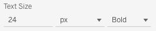

# Text Configuration Details

Dashboard authors have access, via the Preferences Configuration, to control how certain elements of text in the extension will be displayed. Generally, text controls will look like this:



## Size value

The first field in the image above is a text field where you can specify a numeric value for your text size. In the example above, we have set this value to 24.

## Size unit

The second field is a drop down where you can select between four different units that control the size of the text displayed in the extension.

* px: This controls the size of the text in pixels. This is the default option.
* pt: This controls the size of the text in points (similar to most word processing software).
* em / rem: These are scalable units used in web document media. An em is equivalent to the font size of the broader document so, if your browser's default font size is 12pt, 1em would be equivalent to 12pt. **Please note that using em / rem within an extension can produce unpredictable results for a variety of reasons.** In particular, using em/rem often produces a very different look between Tableau Desktop and Tableau Server. 

## Weight

The final field in the image is a drop down where you can select between bold and normal weighting for your text.

## Technical details

This extension makes use of CSS to control formatting so the values specified above are passed into the code that generates CSS for the extension. Using the image above as an example, the generated css would look like this:

```css
{
    font-size: 24px;
    font-weight: bold;
}
```